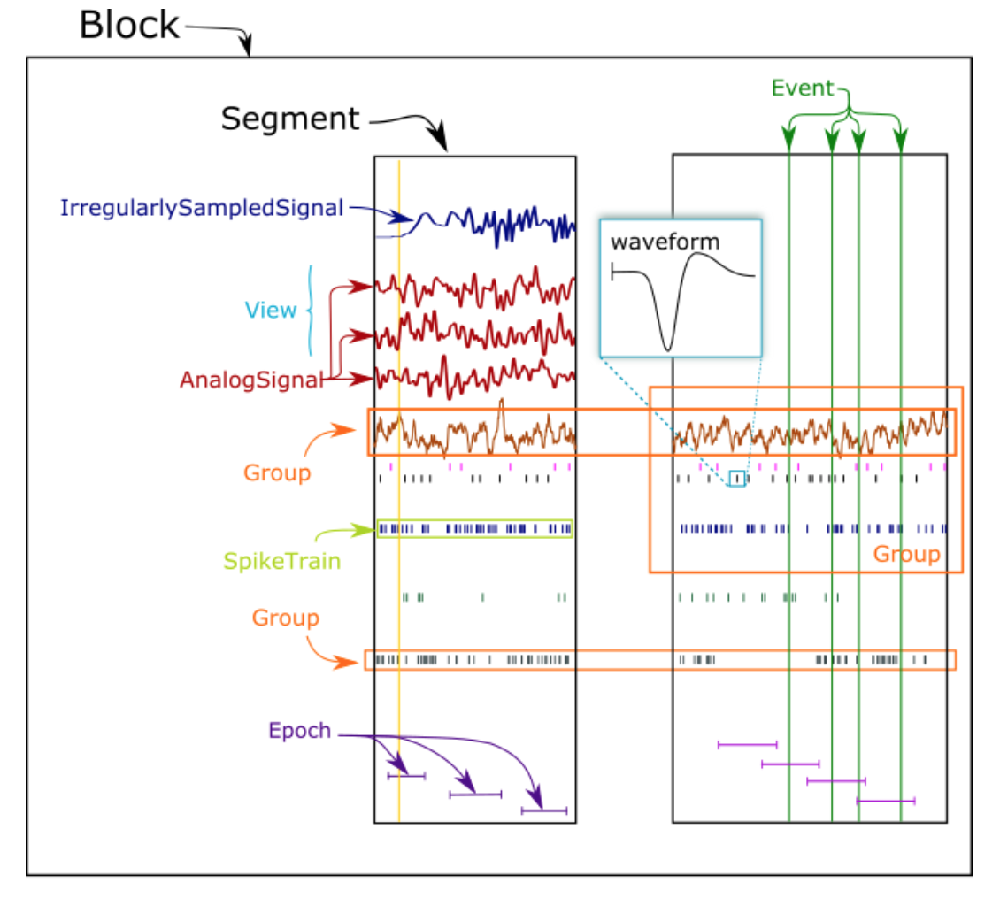
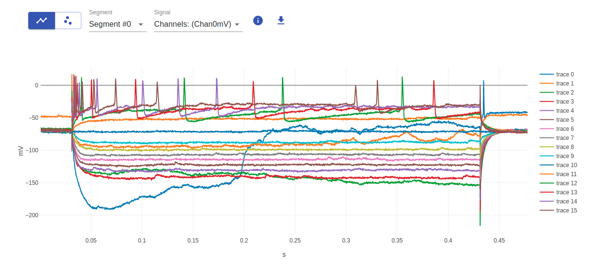

---

title: 'NeoViewer: Visualising Electrophysiology Data'

tags:

* Python
* Neo
* Neuroscience 
* Electrophysiology  
* Visualization

authors:

* name: Onur Ates
  orcid: 0000-0001-7885-9059
  affiliation: 1
* name: Shailesh Appukuttan
  orcid: 0000-0002-0148-8023
  affiliation: 1
* name: Hélissande Fragnaud
  orcid: 0000-0003-4971-5771
  affiliation: 1
* name: Corentin Fragnaud
  orcid: 0000-0002-5232-1143
  affiliation: 1
* name: Andrew P. Davison^\[corresponding author]
  orcid: 0000-0002-4793-7541
  affiliation: 1

affiliations:

* name: Université Paris-Saclay, CNRS, Institut des Neurosciences Paris-Saclay, 91400, Saclay, France
  index: 1

date: 26 April 2022
bibliography: paper.bib

---

# Summary

Researchers investigating the various aspects of brain function routinely record the electrical activity of neurons. The data obtained through these experiments are then stored in a convenient format, to be further studied by the use of different mathematical or graphical tools. One of the biggest challenges while working with neurophysiology data is the incompatibility of file formats when moving the data from one tool or platform to another. Many data recording tools produce proprietary file formats which are often not compatible with the analysis or visualization tools at hand. 

NeoViewer is a web-based tool for visualizing and exploring neurophysiology datasets stored in a wide variety of file formats. It enables neuroscientists to view recordings of membrane potential, local-field potentials, spike trains, and other neurophysiological signals in their web browser, often the first step in understanding a dataset before proceeding to a more in-depth analysis.

# Statement of need

At a time when data sharing is becoming more widely adopted, scientists searching for datasets to use in their research have a need to quickly visualize and explore the data. At the same time, there is a move towards more interactive presentation of scientific data, with "live papers" and other web-based documents appearing as a complement or alternative to traditional, static scientific papers.

NeoViewer was developed to address both of these needs by making it easy to interactively visualize neural activity recordings in a web browser, and easy to add this functionality to existing web sites.

# Functionality

NeoViewer has two components: a web server providing a REST API written using the Django framework and a web component written in Javascript.
The REST API reads neurophysiology data files and makes the content available in JSON format. The web component, with implementations in two of the most popular Javascript frameworks, AngularJS and ReactJS, reads data from the API and displays it in the web browser using the open source Plotly library.

NeoViewer builds on the Neo software, which has support for reading a wide variety of neurophysiology file formats, including proprietary formats such as AlphaOmega, Plexon and NeuroExplorer, and open formats such as Neurodata Without Borders. Neo loads this data into a common object model with the aim of increasing the interoperability of neurophysiology software tools and thus facilitating sharing of data between different projects.

Neo defines various types of neural activity data as illustrated in Fig. \\autoref{fig:neo}. 

_Illustration of different types of data objects handled by Neo._

NeoViewer currently supports the following subset of these: 

* **Block**: outer container for an entire recording session.
* **Segment**: inner container for data objects recorded at the same time, e.g. in response to a given stimulus.
* **SpikeTrain**: an array of action potentials (spikes) emitted over a period of time; see \\autoref{fig:fig:ss_spiketrain}
* **AnalogSignals**: continuous signal data with a fixed sampling interval (e.g. membrane potentials); see \\autoref{fig:ss_analog}
* **IrregularlySampledSignal**: analog signal with a varying sampling interval (e.g. recordings from simulations using a variable-time-step integration method)

_Screenshot of spike trains being plotted using the AngularJS implementation of the tool._

_Screenshot of all analog signals in a segment being plotted simultaneously using the ReactJS implementation of the tool_

Support for other types, such as  'Events' (e.g. triggers during behavioural experiments) and 'Epochs' (e.g. the time during which a stimulus is presented) is planned. Another upcoming feature will be to support visualising the newly implemented 'ImageSequence' type which is used for data produced by functional microscopy such as calcium imaging or voltage-sensitive dye imaging.

NeoViewer can be easily integrated in an HTML document. A single HTML page can contain multiple instances of the NeoViewer. The "source" is the minimal attribute that needs to be set for each instance of the NeoViewer, indicating the URL of the data file to be loaded. After the data is loaded, it is possible to choose different Blocks and Segments, via a drop down menu. In the segments you can select AnalogSignals (including IrregularlySampledSignal) or SpikeTrains, whichever is available in the file. As an example, Segments might include data for a stimulus and the corresponding response of the neuron (e.g. membrane potential) as two separate AnalogSignal plots. 

A more detailed view of the data can be achieved by zooming with mouse gestures. There is an option to show all the signals in the same segment, on the same axes if the units and sampling rates match. It is also possible to show all the signals of a given type across all segments on the same axes. SpikeTrain recordings are represented as a raster plot, with the spikes from each neuron on a separate line and with different colours. Removing and replacing individual traces in a plot takes a single mouse click. Any plot can be downloaded as a PNG image file.

Experiments often produce large volumes of data which in turn can affect the performance of the visualization. NeoViewer therefore provides an optional "down-sample factor" attribute which is used to increase the sampling period of the plot to improve the data loading time. Caching and the use of lazy loading (where individual data arrays are only read on demand) are also used to provide faster loading times. The file format is inferred from the file extension where possible, but since many data recording tools produce output files with the same file extensions (e.g. ".dat"), a web page author can explicitly specify the file type using an HTML tag attribute. The ReactJS version of the component offers some additional attributes to assist in further customization. These are described in the online documentation, along with a live example to help explore them.

## Availability

The REST API can be deployed in a standalone web server (Docker image available) or added to an existing Django project. The ReactJS version of the web component is available from the npm registry; the AngularJS version can be obtained from Github. All source code is available on Github at https://github.com/NeuralEnsemble/neo-viewer.

## Examples of use

The [EBRAINS live paper platform](https://live-papers.brainsimulation.eu/) extensively uses NeoViewer to visualize experimental data from published studies. This allows viewers to readily examine the data from within the webpage, without having to download these files and load them in compatible visualization tools. In summary, NeoViewer is a fast and easy-to-use plotting library for interactive visualization of electrophysiological data with support for a wide range of file formats, thereby contributing to interoperability in neuroscience. 

# _Acknowledgements_

This open source software code was developed in part or in whole in the Human Brain Project, funded from the European Union's Horizon 2020 Framework Programme for Research and Innovation under Specific Grant Agreements No. 720270, No. 785907 and No. 945539 (Human Brain Project SGA1, SGA2 and SGA3).

# References

Garcia S., et al. (2014) Neo: an object model for handling electrophysiology data in multiple formats. Frontiers in Neuroinformatics 8:10: doi:10.3389/fninf.2014.00010

Appukuttan, S., Bologna, L. L., Migliore, M., Schürmann, F., & Davison, A. P. (2021, October 5). EBRAINS Live Papers - Interactive resource sheets for computational studies in neuroscience. <https://doi.org/10.31219/osf.io/4uvdy>

